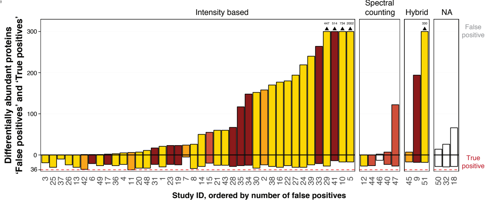
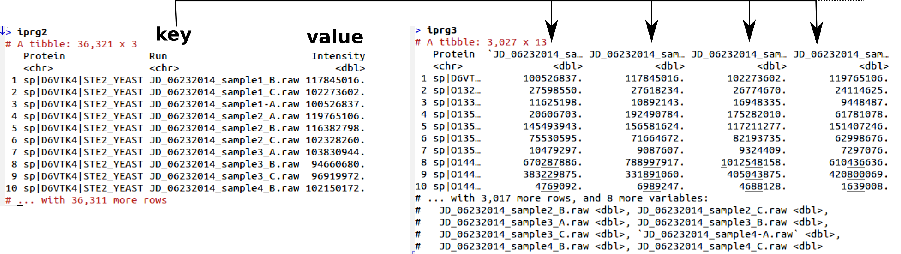
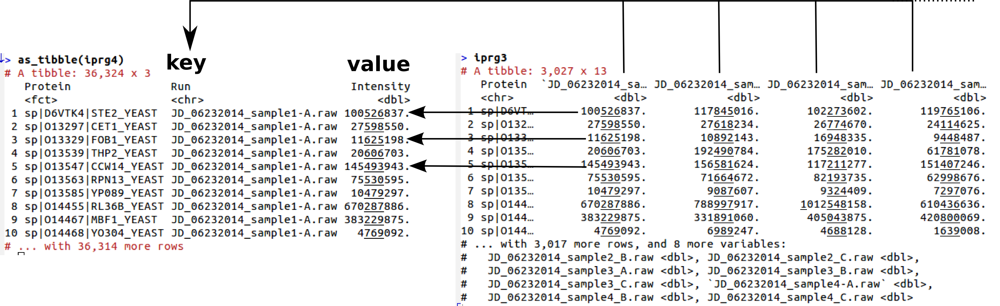

# Example datasets

We will used various datasets throughout the course. These data are
briefly described below, and we will explore them through various
visualisations later.


## Raw MS data

Section *Using R and Bioconductor for MS-based proteomics* shows how
to visualise raw mass spectrometry data. The raw data that will be
using come from the `r Biocexptpkg("msdata")` `r Biocpkg("MSnbase")`
packages. These data will be introduced later.

```{r}
library("msdata")
```


## The iPRG data

This iPRG data is a spiked-in exeriment, where 6 proteins where spiked
at different ratios in a Yeast proteome background. Each run was
repeated in triplicates and order was randomised. Participants in the
study were asked to identify the differentially abundant spiked-in
proteins.



> Choi M, Eren-Dogu ZF, Colangelo C, Cottrell J, Hoopmann MR, Kapp EA,
> Kim S, Lam H, Neubert TA, Palmblad M, Phinney BS, Weintraub ST,
> MacLean B, Vitek O. *ABRF Proteome Informatics Research Group (iPRG)
> 2015 Study: Detection of Differentially Abundant Proteins in
> Label-Free Quantitative LC-MS/MS Experiments*.  J Proteome Res. 2017
> Feb 3;16(2):945-957. doi:
> [10.1021/acs.jproteome.6b00881](https://doi.org/10.1021/acs.jproteome.6b00881)
> Epub 2017 Jan 3. PMID: 27990823.


```{r irpg, cache = TRUE}
iprg <- read.csv("http://bit.ly/VisBiomedDataIprgCsv")
head(iprg)
dim(iprg)
table(iprg$Condition, iprg$TechReplicate)
```


This data is in the so-called long format. In some applications, it is
more convenient to have the data in wide format, where rows contain
the protein expression data for all samples.

Let's start by simplifying the data to keep only the relevant columns:

```{r iprg2}
head(iprg2 <- iprg[, c(1, 3, 6)])
```

We can convert the `iPRG` into a wide format with `tidyr::spread`:

```{r iprg3}
library("tidyr")
iprg3 <- spread(iprg2, key = Run, value = Intensity)
head(iprg3)
nrow(iprg3)
```



```{r iprgcheck, echo=FALSE}
stopifnot(identical(length(unique(iprg$Protein)), nrow(iprg3)))
```

Indeed, we started with

```{r lengthiprg}
length(unique(iprg$Protein))
```

unique proteins, which corresponds to the number of rows in the new
wide dataset.

The long format is ideal when using `ggplot2`, as we will see in a
later chapter. The wide format has also advantages. For example, it
becomes straighforward to verify if there are proteins that haven't
been quantified in some samples.

```{r iprg3na}
(k <- which(is.na(iprg3), arr.ind = dim(iprg3)))
iprg3[unique(k[, "row"]), ]
```

The opposite operation to `spread` is `gather`, also from the `tidyr`
package:

```{r iprg4}
head(iprg4 <- gather(iprg3, key = Run, value = Intensity, -Protein))
```




The two lond datasets, `iprg2` and `iprg4` are different due to the
missing values shown above.

```{r iprgnrow}
nrow(iprg2)
nrow(iprg4)
nrow(na.omit(iprg4))
```

which can be accounted for by removing rows with missing values by
setting `na.rm = TRUE`.

```{r iprg5}
head(iprg5 <- gather(iprg3, key = Run, value = Intensity, -Protein, na.rm = TRUE))
```

## CRC training data

This dataset comes from the `r Biocexptpkg("MSstatsBioData")` package
and was generated as follows:

```{r crctrain, eval = FALSE}
library("MSstats")
library("MSstatsBioData")
data(SRM_crc_training)
Quant <- dataProcess(SRM_crc_training)
subjectQuant <- quantification(Quant)
```

It provides quantitative information for 72 proteins, including two
standard proteins, *AIAG-Bovine* and *FETUA-Bovine*. These proteins
were targeted for plasma samples with SRM with isotope labeled
reference peptides in order to identify candidate protein biomarker
for non-invasive detection of CRC. The training cohort included 100
subjects in control group and 100 subjects with CRC. Each sample for
subject was measured in a single injection without technical
replicate. The training cohort was analyzed with Skyline. The dataset
was already normalized as described in manuscript. User do not need
extra normalization. NAs should be considered as censored missing. Two
standard proteins can be removed for statistical analysis.

Clinical information where added manually thereafter.

To load this dataset:

```{r crcread, cache = TRUE}
crcdf <- read.csv("http://bit.ly/VisBiomedDataCrcCsv")
crcdf[1:10, 1:3]
```

This dataset is in the wide format. It contains the intensity of the
proteins in columns 1 to 72 for each of the 200 samples along the
rows. Generally, omics datasets contain the features (proteins,
transcripts, ...) along the rows and the samples along the columns.

In columns 73 to 79, we sample metadata.

```{r iprgshow}
crcdf[1:10, 73:79]
```

A widely used data structure for omics data follows the convention
described in the figure below:


This typical omics data structure, as defined by the `eSet` class in
the Bioconductor `Biobase` package, is represented below. It’s main
features are

-  An assay data slot containing the quantitative omics data
   (expression data), stored as a `matrix` and accessible with
   `exprs`. Features defined along the rows and samples along the
   columns.

- A sample metadata slot containing sample co-variates, stored as an
  annotated `data.frame` and accessible with `pData`. This data frame
  is stored with rows representing samples and sample covariate along
  the columns, and its rows match the expression data columns exactly.

- A feature metadata slot containing feature co-variates, stored as an
  annotated `data.frame` and accessible with `fData`. This dataframe’s
  rows match the expression data rows exactly.

The coordinated nature of the high throughput data guarantees that the
dimensions of the different slots will always match (i.e the columns
in the expression data and then rows in the sample metadata, as well
as the rows in the expression data and feature metadata) during data
manipulation. The metadata slots can grow additional co-variates
(columns) without affecting the other structures.

Below, we show how to transform the `crc` dataset into an `MSnSet`
(implementing the data structure above for quantitative proteomics
data) using the `readMSnSet2` function.

```{r crcmsnset}
library("MSnbase")
i <- 1:72 ## expression columns
e <- t(crcdf[, i]) ## expression data
colnames(e) <- 1:200
crc <- readMSnSet2(data.frame(e), e = 1:200)

pd <- crcdf[, -i]
rownames(pd) <- paste0("X", rownames(pd))
pData(crc) <- pd
crc
```

Let's also set the sample names.

```{r}
sampleNames(crc) <- crc$Sample
```

To download and load the `MSnSet` direcly:

```{r crcload, cache = TRUE}
download.file("http://bit.ly/VisBiomedDataCrcMSnSet", "./data/crc.rda")
load("./data/crc.rda")
crc
```

Reference:

> See Surinova, S. et al. (2015) *Prediction of colorectal cancer
> diagnosis based on circulating plasma proteins*. EMBO Mol. Med., 7,
> 1166–1178 for details.

## Time course from Mulvey *et al.* 2015

This data comes from

> Mulvey CM, Schröter C, Gatto L, Dikicioglu D, Fidaner IB,
> Christoforou A, Deery MJ, Cho LT, Niakan KK, Martinez-Arias A,
> Lilley KS. Dynamic Proteomic Profiling of Extra-Embryonic Endoderm
> Differentiation in Mouse Embryonic Stem Cells. Stem Cells. 2015
> Sep;33(9):2712-25. doi:
> [10.1002/stem.2067](https://doi.org/10.1002/stem.2067). Epub 2015
> Jun 23. PMID: 26059426.


```{r loadmulvey}
library("pRolocdata")
data(mulvey2015norm)
```

This `MSnSet`, available from the `r Biocexptpkg("pRolocdata")`
package, measured the expression profiles of `r nrow(mulvey2015norm)`
proteins along 6 time points in triplicate.

```{r showmulvey}
MSnbase::exprs(mulvey2015norm)[1:5, 1:3]
pData(mulvey2015norm)
```

## ALL data

```{r all}
library("ALL")
data(ALL)
ALL
```

From the documentation page:

> The *Acute Lymphoblastic Leukemia Data from the Ritz Laboratory*
> consist of microarrays from 128 different individuals with acute
> lymphoblastic leukemia (ALL). A number of additional covariates are
> available. The data have been normalized (using rma) and it is the
> jointly normalized data that are available here.

The `ALL` data is of class `ExpressionSet`, which implements the data
structure above for microarray expression data, and contains
normalised and summarised transcript intensities.

Below, we select will patients with B-cell lymphomas and BCR/ABL
abnormality and negative controls.

```{r allbcrneg}
table(ALL$BT)
table(ALL$mol.biol)
ALL_bcrneg <- ALL[, ALL$mol.biol %in% c("NEG", "BCR/ABL") & grepl("B", ALL$BT)]
ALL_bcrneg$mol.biol <- factor(ALL_bcrneg$mol.biol)
```

We then use the `r Biocpkg("limma")` package to

```{r limma}
library("limma")
design <- model.matrix(~0+ALL_bcrneg$mol.biol)
colnames(design) <- c("BCR.ABL", "NEG")

## Step1: linear model. lmFit is a wrapper around lm in R
fit1 <- lmFit(ALL_bcrneg, design)

## Step 2: fit contrasts: find genes that respond to estrogen
contrast.matrix <- makeContrasts(BCR.ABL-NEG, levels = design)
fit2 <- contrasts.fit(fit1, contrast.matrix)

## Step3: add empirical Bayes moderation
fit3 <- eBayes(fit2)

## Extract results and set them to the feature data
res <- topTable(fit3, n = Inf)
fData(ALL_bcrneg) <- res[featureNames(ALL_bcrneg), ]
```

```{r filexists, echo=FALSE}
if (!file.exists("./data/ALL_bcrneg.rda"))
	save(ALL_bcrneg, file = "./data/ALL_bcrneg.rda")
```

This annotated `ExpressionSet` can be reproduced as shown above or
downloaded and loaded using

```{r downloadallbcrneg, cache = TRUE}
download.file("http://bit.ly/VisBiomedDataALL_bcrneg",  "./data/ALL_bcrneg.rda")
load("./data/ALL_bcrneg.rda")
```

Reference:

> Sabina Chiaretti, Xiaochun Li, Robert Gentleman, Antonella Vitale,
> Marco Vignetti, Franco Mandelli, Jerome Ritz, and Robin Foa *Gene
> expression profile of adult T-cell acute lymphocytic leukemia
> identifies distinct subsets of patients with different response to
> therapy and survival*. Blood, 1 April 2004, Vol. 103, No. 7.


## Spatial proteomics data

The goal of spatial proteomics is to study the sub-cellular
localisation of proteins. The data below comes from

> Christoforou A, Mulvey CM, Breckels LM, Geladaki A, Hurrell T,
> Hayward PC, Naake T, Gatto L, Viner R, Martinez Arias A, Lilley
> KS. A draft map of the mouse pluripotent stem cell spatial
> proteome. Nat Commun. 2016 Jan 12;7:8992. doi:
> [10.1038/ncomms9992](https://doi.org/10.1038/ncomms9992). PMID:
> 26754106; PMCID: PMC4729960.

and investigated the sub-cellular location of over 5000 proteins in
mouse pluripotent stem cells using a mass spectrometry-based technique
called hyperLOPIT.

```{r}
library("pRolocdata")
data(hyperLOPIT2015)
dim(hyperLOPIT2015)
```

In addition to the quantitative data, another important piece of data
here are the spatial markers, proteins for which we can confidently
assign them a sub-cellular location apriori. These markers are defined
in the `markers` feature variable:

```{r}
table(fData(hyperLOPIT2015)$markers)
```

Here, the columns of the data represent fractions along a density
gradient used to separate the sub-cellular proteome presented in this
data.


We will be using a simplified version of this data in the next
chapters. Below, we retain the first replicate
(`hyperLOPIT2015$Replicate == 1]`) and the marker proteins (using the
`markerMSnSet` function):

```{r}
library("pRoloc")
hlm <- markerMSnSet(hyperLOPIT2015[, hyperLOPIT2015$Replicate == 1])
dim(hlm)
getMarkerClasses(hlm) ## no unknowns anymore
```
