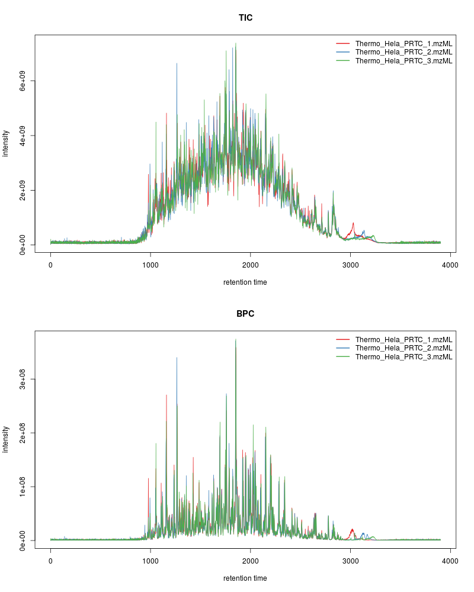
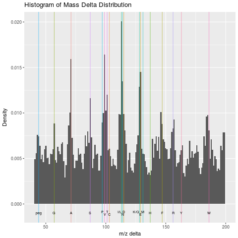
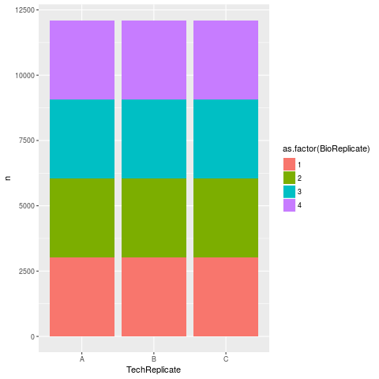

# Exploring and visualising biomolecular data

This chapter provides an overview of a typical omics data analysis,
exploration of the data, statistical analysis and their associated
visualisations. We will look into the respective figures and how to
produce them in the later chapters.


## Raw data {-}




## Tracking an ion from the chromatogram to the MS2 spectra {-}

See [here](https://lgatto.github.io/RforProteomics/articles/RProtVis.html#visualising-mass-spectrometry-data) for details and code.


## Raw data QC {-}

See [`?plotMzDelta`](https://lgatto.github.io/MSnbase/reference/plotMzDelta-methods.html) for details and code.




## Exploring the experimental design {-}

```{r crctab, echo = FALSE, message = FALSE}
pd <- pData(crc)
table(cut(pd$Age, 5), pd$Gender)
```

```{r crchist, echo=FALSE, warning=FALSE}
ggplot(pd, aes(x = Age)) + geom_histogram() + facet_grid(Gender ~ Group)
```




```{r pcamulvey, echo=FALSE}
setStockcol(paste0(getStockcol(), 80))
.pca <- plot2D(t(mulvey2015norm), fcol = "times", cex = 4)
text(.pca[, 1], .pca[, 2], mulvey2015norm$rep)
addLegend(t(mulvey2015norm), fcol = "times", where = "bottomright", cex = 2)
```


## Quantitative data {-}

```{r norm, echo = FALSE, fig.width = 8, fig.height = 8}
par(mfrow = c(2, 1))
boxplot(MSnbase::exprs(hyperLOPIT2015))
boxplot(MSnbase::exprs(normalise(hyperLOPIT2015, method = "quantiles")),
		main = "Variance stabilisation normalisation")
```

```{r mulvdensity, echo=FALSE}
setStockcol(NULL)
cls <- getStockcol()
i <- seq_len(ncol(mulvey2015norm))
plot(density(MSnbase::exprs(mulvey2015norm)), ylim = c(0, 5), type = "n",
	 main = "Mulvey et al. 2015")
tmp <- sapply(i, function(ii) {
	lines(density(MSnbase::exprs(mulvey2015norm[, ii])),
			  col = cls[ii])
})
legend("topright", sampleNames(mulvey2015norm),
	   lty = 1, col = cls[1:18], bty = "n",
	   ncol = 2)
```


```{r pcaspat, echo=FALSE, fig.width = 8, fig.height = 8}
data("hyperLOPIT2015")
plot2D(hyperLOPIT2015, fcol = "final.assignment",
	   cex = exp(fData(hyperLOPIT2015)$svm.score) - .8,
	   main = "Mouse stem cell spatial map")
addLegend(hyperLOPIT2015)
```


## Differential expression {-}


