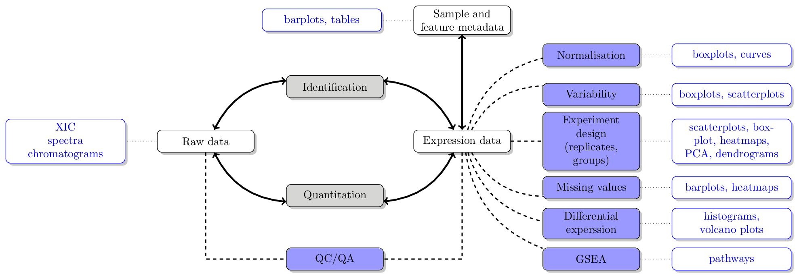

# Exploring and visualising biomolecular data

This chapter provides an overview of a typical omics data analysis,
exploration of the data, statistical analysis and their associated
visualisations. We will look into the respective figures and how to
produce them in the later chapters.




## TIC and BPC chromatograms {-}


## Tracking an ion from the chromatogram to the MS2 spectra {-}

See [here](https://lgatto.github.io/RforProteomics/articles/RProtVis.html#visualising-mass-spectrometry-data) for details and code.


## Exploring the experimental design

```{r crctab, echo=TRUE}
pd <- pData(crc)
table(cut(pd$Age, 5), pd$Gender)
```

```{r crchist, echo=TRUE}
ggplot(pd, aes(x = Age)) + geom_histogram() + facet_grid(Gender ~ Group)
```


## Raw data QC

See [`?plotMzDelta`](https://lgatto.github.io/MSnbase/reference/plotMzDelta-methods.html) for details and code.


## Differential expression


