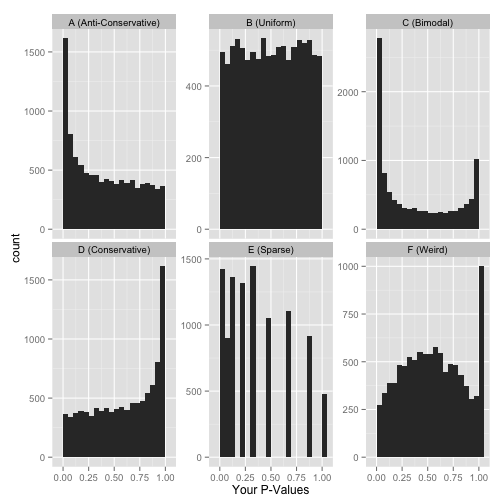

# Tools and plots

## Transformations

### Expression data

Let's start with the comparison of two vectors of matching expression
intensities such as those from two samples in the `iprg3`
dataset. Let's extract the intensities of samples `r names(iprg3)[2]`
(second column) and `r names(iprg3)[3]` (third column) and produce a
scatter plot of one against the other.

```{r trans1}
x <- iprg3[[2]]
y <- iprg3[[3]]
plot(x, y)
```

Due to the distribution of the raw intensities, where most of the
intensities are low with very few high intensities (see density plots
below), the majority of points are squeezed close to the origin of the
scatter plot.

```{r denstrans1}
plot(density(na.omit(x)), col = "blue")
lines(density(na.omit(y)), col = "red")
```

This has negative effects as it (1) leads to overplotting in the low
intensity range and (2) gives too much confidence in the correlation
of the two vectors. A simple way to avoid this effect is to directly
log-tranform the data or set the graph axes to log scales:

```{r plotrans1log}
par(mfrow = c(1, 2))
plot(log10(x), log10(y))
plot(x, y, log = "xy")
```

We will see better visualisations to detect correlation between sample
replicates below.

It is possible to generalise to production of scatter plots to more
samples using the `pairs` function:

```{r pairs}
pairs(iprg3[2:6], log = "xy")
```

A lot of space is wasted by repeating the same sets of plots in the
upper right and lower left triangles of the matrix. See the `pairs`
documentation page.

A general technique to overcome overplotting is to set the alpha scale
(transparency), of to use `graphics::smoothScatter`:

```{r smoothscatter}
par(mfrow = c(1, 2))
plot(x, y, pch = 19, col = "#00000010", log = "xy")
smoothScatter(log10(x), log10(y))
```

### Fold changes

Log-transformation also comes handy when computing fold-changes. Below
we calculate the fold-changes and log2 fold-changes (omitting missing
values)

```{r fc}
fc <- na.omit(iprg3[[2]] / iprg3[[3]])
lfc <- log2(fc)
```

Below, we see how the log2 fold-changes become symmetrical around zero
(the absence of change), with positive values corresponding to
up-regulation and negative values to down-regulation.

```{r lfcplot}
plot(density(lfc), ylim = c(0, 5))
abline(v = median(lfc))
lines(density(fc), col = "red")
abline(v = median(fc), col = "red")
```

**Note**: when the data is already log-transformed, log fold-changes
are computed by subtracting values.

## Comparing samples and linear models

Let's return to the scatter plot example above and focus on three
replicates from consitions 1 and 4, remove missing values and
log-tranform the intensites.


```{r linmod1}
x <- log2(na.omit(iprg3[, c(2, 3, 11)]))
```

Below, we use the pairs function and print the pairwise correlations
in the upper right traingle.

```{r linmodpairs}
## put (absolute) correlations on the upper panels,
## with size proportional to the correlations.
## From ?pairs
panel.cor <- function(x, y, digits = 2, prefix = "", cex.cor, ...) {
	usr <- par("usr"); on.exit(par(usr))
	par(usr = c(0, 1, 0, 1))
	r <- abs(cor(x, y))
	txt <- format(c(r, 0.123456789), digits = digits)[1]
	txt <- paste0(prefix, txt)
	if (missing(cex.cor)) cex.cor <- 0.8/strwidth(txt)
	text(0.5, 0.5, txt, cex = cex.cor * r)
}
pairs(x, lower.panel = panel.smooth, upper.panel = panel.cor)
```

It is often assumed that high correlation is a halmark of good
replication. Rather than focus on the correlation of the data, a
better measurement would be to look a the log2 fold-changes, i.e. the
distance between repeated measurements. The ideal way to visualise
this is on an MA-plot:


```{r ma, fig.width = 12}
par(mfrow = c(1, 2))
r1 <- x[[1]]
r2 <- x[[2]]
M <- r1 - r2
A <- (r1 + r2)/2
plot(A, M); grid()
library("affy")
affy::ma.plot(A, M)
```

See also this
[post](http://simplystatistics.org/2015/08/12/correlation-is-not-a-measure-of-reproducibility/)
on the *Simply Statistics* blog.

`abline(0, 1)` can be used to add a line with intercept 0 and
slop 1. It we want to add the line that models the data linearly, we
can calculate the parameters using the `lm` function:

```{r lmod}
lmod <- lm(r2 ~ r1)
summary(lmod)
```

which can be used to add the adequate line that reflects the (linear)
relationship between the two data

```{r lmodplot}
plot(r1, r2)
abline(lmod, col = "red")
```

As we have seen in the beginning of this section, it is essential not
to rely solely on the correlation value, but look at the data. This
also holds true for linear (or any) modelling, which can be done by
plotting the model:

```{r lmodplot2}
par(mfrow = c(2, 2))
plot(lmod)
```

* *Cook's distance* is a commonly used estimate of the influence of a
  data point when performing a least-squares regression analysis and
  can be used to highlight points that particularly influence the
  regression.

* *Leverage* quantifies the influence of a given observation on the
  regression due to its location in the space of the inputs.

See also `?influence.measures`.

> **Challenge**
>
> 1. Take any of the `iprg3` replicates, model and plot their linear
>    relationship.
> 2. The Anscombe quartet is available as `anscombe`. Load it, create
>    a linear model for one $(x_i, y_i)$ pair of your choice and
>    visualise/check the model.

<details>
```{r anscombechallenge}
x3 <- anscombe[, 3]
y3 <- anscombe[, 7]
lmod <- lm(y3 ~ x3)
summary(lmod)
par(mfrow = c(2, 2))
plot(lmod)
```
</details>

## Plots for statistical analyses

Let's use the `ALL_bclneg` dataset, that we already have analysed with
`r Biocpkg("limma")` in the *Data* chapter.

Whenever performing a statistical test, it is important to quality
check the distribution of non-adjusted p-values. Below, we see an
enrichment of small p-values, as opposed to a uniform distribution to
be expected under the null hypothesis of absence of changes between
groups.

```{r histpv}
fvarLabels(ALL_bcrneg)
hist(fData(ALL_bcrneg)$P.Value)
```

The histograms below illustrate [other
distributions](http://varianceexplained.org/statistics/interpreting-pvalue-histogram/)
to beware of.



Another important visualisation for statistical results are the
*Volcano plots*, that show the relationship between the significance
of the individual tests (adjusted p-values) and their magnitude of the
effect (log2 fold-changes).


```{r volc}
lfc <- fData(ALL_bcrneg)$logFC
bh <- fData(ALL_bcrneg)$adj.P.Val
plot(lfc, -log10(bh),
	 main = "Volcano plot",
	 xlab = expression(log[2]~fold-change),
	 ylab = expression(-log[10]~adjusted~p-value))
grid()
```

The volcano plot can further be annotated using vertical and
horizontal lines depicting thresholds of interest or points can be
colour-coded based on their interest.

```{r volc2}
lfc <- fData(ALL_bcrneg)$logFC
bh <- fData(ALL_bcrneg)$adj.P.Val
sign <- abs(lfc) > 1 & bh < 0.01
plot(lfc, -log10(bh),
	 main = "Volcano plot",
	 col = ifelse(sign, "red", "black"),
	 pch = ifelse(sign, 19, 1),
	 xlab = expression(log[2]~fold-change),
	 ylab = expression(-log[10]~adjusted~p-value))
grid()
abline(v = c(-1, 1), lty = "dotted")
abline(h = -log10(0.05), lty = "dotted")
```

It is also possible to identify and label individual points on the
plot using the `identify` function

```{r identify, eval = FALSE}
i <- identify(lfc, -log10(bh), featureNames(ALL_bcrneg))
```

```{r volc3, echo=FALSE}
lfc <- fData(ALL_bcrneg)$logFC
bh <- fData(ALL_bcrneg)$adj.P.Val
sign <- abs(lfc) > 1 & bh < 0.01
plot(lfc, -log10(bh),
	 main = "Volcano plot",
	 col = ifelse(sign, "red", "black"),
	 pch = ifelse(sign, 19, 1),
	 xlab = expression(log[2]~fold-change),
	 ylab = expression(-log[10]~adjusted~p-value))
grid()
abline(v = c(-1, 1), lty = "dotted")
abline(h = -log10(0.05), lty = "dotted")
text(lfc[i], -log10(bh)[i], featureNames(ALL_bcrneg)[i], pos = 2)
```

## Visualising intersections

Venn and Euler diagrams are popular representation when comparing sets
and their intersection. Two useful R packages to generate such plots
are `r CRANpkg("venneuler")` and `r Githubpkg("js229/Vennerable")`.

We will use the `crc` feature names to generate a test data:

```{r venn}
set.seed(123)
x <- replicate(3, sample(featureNames(crc), 35), simplify = FALSE)
names(x) <- LETTERS[1:3]
(v <- Venn(x))
plot(v)
```

The `r CRANpkg("UpSetR")` visualises intersections of sets as a matrix
in which the rows represent the sets and the columns represent their
intersection sizes. For each set that is part of a given intersection,
a black filled circle is placed in the corresponding matrix cell. If a
set is not part of the intersection, a light gray circle is shown. A
vertical black line connects the topmost black circle with the
bottom most black circle in each column to emphasise the column-based
relationships. The size of the intersections is shown as a bar chart
placed on top of the matrix so that each column lines up with exactly
one bar. A second bar chart showing the size of the each set is shown
to the left of the matrix.

We will first make use of the `fromList` function to convert our list
to a `UpSetR` compatible input and then generate the figure:

```{r upset1}
library("UpSetR")
x2 <- fromList(x)
upset(x2)
```

The following
[tweet](https://twitter.com/ngehlenborg/status/986354574989709312) by
the author of the package illustrates how Venn and upset diagrams
relate to each other.


```{r upse2}
upset(x2, order.by = "freq")
upset(x2, order.by = "degree")
upset(x2, order.by = c("freq", "degree"))
upset(x2, order.by = c("degree", "freq"))

upset(x2, sets = c("A", "B"))
upset(x2, sets = c("B", "C", "A"), keep.order = TRUE)

upset(x2, group.by = "sets")

## Add set D with a single intersection
x3 <- x2
x3$D <- 0
x3[1, "D"] <- 1
head(x3)

upset(x3)
upset(x3, empty.intersections = "on")
```

Visualising intersections with `UpSetR` shines with more that 4 sets,
as Venn diagrams become practically useless.


> **Challenge**
>
> Generate a bigger dataset containing 10 sets. Try to generate Venn
> and upset diagrams as shown above.
>
> ```{r upsetchallenge}
> set.seed(123)
> x <- replicate(10, sample(featureNames(crc), 35), simplify = FALSE)
> names(x) <- LETTERS[1:10]
> ```

When the number of sets become larger, the options above, as well as
`nsets`, the number of sets (default is 5) and `nintersects`, the
number of intersectios (default is 40) becomes useful.

## Unsupervised learning

In **unsupervised learning** (UML), no labels are provided, and the
learning algorithm focuses solely on detecting structure in unlabelled
input data. One generally differentiates between

- **Clustering**, where the goal is to find homogeneous subgroups
  within the data; the grouping is based on distance between
  observations.

- **Dimensionality reduction**, where the goal is to identify patterns in
  the features of the data. Dimensionality reduction is often used to
  facilitate visualisation of the data, as well as a pre-processing
  method before supervised learning.

UML presents specific challenges and benefits:

- there is no single goal in UML
- there is generally much more unlabelled data available than labelled
  data.

Unsupervised learning techniques are paramount for exploratory data
analysis and visualisation.

## k-means clustering

The k-means clustering algorithms aims at partitioning *n*
observations into a fixed number of *k* clusters. The algorithm will
find homogeneous clusters.

In R, we use

```{r kmeans1, eval=FALSE}
stats::kmeans(x, centers = 3, nstart = 10)
```

where

- `x` is a numeric data matrix
- `centers` is the pre-defined number of clusters
- the k-means algorithm has a random component and can be repeated
  `nstart` times to improve the returned model

> Challenge:
>
> - To learn about k-means, let's use the `iris` dataset with the sepal and
>   petal length variables only (to facilitate visualisation). Create
>   such a data matrix and name it `x`

```{r solirisx, echo=FALSE}
i <- grep("Length", names(iris))
x <- iris[, i]
```

> - Run the k-means algorithm on the newly generated data `x`, save
>   the results in a new variable `cl`, and explore its output when
>   printed.

```{r solkmcl, echo=FALSE}
cl <- kmeans(x, 3, nstart = 10)
```

> - The actual results of the algorithms, i.e. the cluster membership
>   can be accessed in the `clusters` element of the clustering result
>   output. Use it to colour the inferred clusters to generate a figure
>   like that shown below.

```{r solkmplot, echo=FALSE, fig.cap = "k-means algorithm on sepal and petal lengths"}
plot(x, col = cl$cluster)
```

<details>
```{r soliris, eval=FALSE}
i <- grep("Length", names(iris))
x <- iris[, i]
cl <- kmeans(x, 3, nstart = 10)
plot(x, col = cl$cluster)
```
</details>

### How does k-means work {-}

**Initialisation**: randomly assign class membership


```{r kmworksinit, fig.cap="k-means random intialisation"}
set.seed(12)
init <- sample(3, nrow(x), replace = TRUE)
plot(x, col = init)
```

**Iteration**:

1. Calculate the centre of each subgroup as the average position of
   all observations is that subgroup.
2. Each observation is then assigned to the group of its nearest
   centre.

It's also possible to stop the algorithm after a certain number of
iterations, or once the centres move less than a certain distance.

```{r kmworksiter, fig.width = 12, fig.cap="k-means iteration: calculate centers (left) and assign new cluster membership (right)"}
par(mfrow = c(1, 2))
plot(x, col = init)
centres <- sapply(1:3, function(i) colMeans(x[init == i, ], ))
centres <- t(centres)
points(centres[, 1], centres[, 2], pch = 19, col = 1:3)

tmp <- dist(rbind(centres, x))
tmp <- as.matrix(tmp)[, 1:3]

ki <- apply(tmp, 1, which.min)
ki <- ki[-(1:3)]

plot(x, col = ki)
points(centres[, 1], centres[, 2], pch = 19, col = 1:3)
```

**Termination**: Repeat iteration until no point changes its cluster
membership.


### Model selection  {-}

Due to the random initialisation, one can obtain different clustering
results. When k-means is run multiple times, the best outcome,
i.e. the one that generates the smallest *total within cluster sum of
squares (SS)*, is selected. The total within SS is calculated as:

For each cluster results:

- for each observation, determine the squared euclidean distance from
  observation to centre of cluster
- sum all distances

Note that this is a **local minimum**; there is no guarantee to obtain
a global minimum.

> Challenge:
>
> Repeat k-means on our `x` data multiple times, setting the number of
> iterations to 1 or greater and check whether you repeatedly obtain
> the same results. Try the same with random data of identical
> dimensions.

<details>
```{r selrep, fig.width = 12, fig.cap = "Different k-means results on the same (random) data"}
cl1 <- kmeans(x, centers = 3, nstart = 10)
cl2 <- kmeans(x, centers = 3, nstart = 10)
table(cl1$cluster, cl2$cluster)

cl1 <- kmeans(x, centers = 3, nstart = 1)
cl2 <- kmeans(x, centers = 3, nstart = 1)
table(cl1$cluster, cl2$cluster)

set.seed(42)
xr <- matrix(rnorm(prod(dim(x))), ncol = ncol(x))
cl1 <- kmeans(xr, centers = 3, nstart = 1)
cl2 <- kmeans(xr, centers = 3, nstart = 1)
table(cl1$cluster, cl2$cluster)
diffres <- cl1$cluster != cl2$cluster
par(mfrow = c(1, 2))
plot(xr, col = cl1$cluster, pch = ifelse(diffres, 19, 1))
plot(xr, col = cl2$cluster, pch = ifelse(diffres, 19, 1))
```
</details>

### How to determine the number of clusters  {-}

1. Run k-means with `k=1`, `k=2`, ..., `k=n`
2. Record total within SS for each value of k.
3. Choose k at the *elbow* position, as illustrated below.

```{r kmelbow, echo=FALSE, fig.cap = ""}
ks <- 1:5
tot_within_ss <- sapply(ks, function(k) {
	cl <- kmeans(x, k, nstart = 10)
	cl$tot.withinss
})
plot(ks, tot_within_ss, type = "b",
	 ylab = "Total within squared distances",
	 xlab = "Values of k tested")
```

> Challenge
>
> Calculate the total within sum of squares for k from 1 to 5 for our
> `x` test data, and reproduce the figure above.

<details>
```{r solkmelbow, eval = FALSE}
ks <- 1:5
tot_within_ss <- sapply(ks, function(k) {
	cl <- kmeans(x, k, nstart = 10)
	cl$tot.withinss
})
plot(ks, tot_within_ss, type = "b")
```
</details>

There exists other metrics, other than the total within cluster sum of
squares that can be applied, such as the gap statistic (see
`cluster::clusGap`), or the Akaike (AIC) and Bayesian (BIC)
information criteria.

### Challenge {-}

Let's use what we have learned to cluster the `r nrow(mulvey2015norm)`
proteins from the `mulvey2015norm` data in 20 clusters.

1. Use k-means to cluster the `mulvey2015norm` data, setting `centers
   = 20`. Take care in repeating the clustering more than once.

2. To plot the expression profiles for the 20 clusters, I suggest to
   use `gplot2`. Do do so, create a `r nrow(mulvey2015norm)` proteins
   by `r ncol(mulvey2015norm)` sample dataframe (or tibble), appending
   the protein accession numbers (from the feature data - you can use
   the `MSnbase::ms2df` helper function.) and cluster numbers as 2
   additional columns.

3. Use `gather` to transform the data in a long format.

4. Use `ggplot2` to reproduce the figure below. Optional: use
   `stat_summary` to add a mean profile for each cluster of proteins.


<details>
```{r mulveykmeans, eval=FALSE}
library("pRolocdata")
data(mulvey2015norm)

cl <- kmeans(MSnbase::exprs(mulvey2015norm),
			 centers = 16, nstart = 10, iter.max = 50)

x <- ms2df(mulvey2015norm, fcol = "Accession")
x[["cluster"]] <- cl$cluster
tb <- gather(x, key = sample, value = expression, -cluster, -Accession) %>%
	as_tibble

## Check dimensions
stopifnot(nrow(tb) == prod(dim(mulvey2015norm)))

pd <- pData(mulvey2015norm)
tb$time <- pd[tb[["sample"]], "times"]
tb$rep <- pd[tb[["sample"]], "rep"]

## Plotting
kmp <- ggplot(data = tb,
			  aes(x = paste(time, rep), y = expression,
				  group = Accession, colour = as.factor(cluster))) +
	geom_line() +
	facet_wrap(~ cluster) +
	theme(legend.position = "none") +
	scale_x_discrete("Time course")

kmp2 <- kmp +
	stat_summary(aes(group = cluster),
				 fun.y = mean, geom = "line",
				 colour = "black")
```
</details>

## Hierarchical clustering

### How does hierarchical clustering work {-}

**Initialisation**:  Starts by assigning each of the n points its own cluster

**Iteration**

1. Find the two nearest clusters, and join them together, leading to
   n-1 clusters
2. Continue the cluster merging process until all are grouped into a
   single cluster

**Termination:** All observations are grouped within a single cluster.

```{r hcldata, fig.width = 12, echo=FALSE, fig.cap = "Hierarchical clustering: initialisation (left) and colour-coded results after iteration (right)."}
set.seed(42)
xr <- data.frame(x = rnorm(5),
				 y = rnorm(5))
cls <- c("red", "blue", "orange", "blue", "orange")
cls <- scales::col2hcl(cls, alpha = 0.5)
par(mfrow = c(1, 2))
plot(xr, cex = 3)
text(xr$x, xr$y, 1:5)
plot(xr, cex = 3, col = cls, pch = 19)
text(xr$x, xr$y, 1:5)
```

The results of hierarchical clustering are typically visualised along
a **dendrogram**, where the distance between the clusters is
proportional to the branch lengths.


```{r hcldendro, echo=FALSE, fig.cap = "Visualisation of the hierarchical clustering results on a dendrogram"}
plot(hcr <- hclust(dist(xr)))
```

In R:

- Calculate the distance using `dist`, typically the Euclidean
  distance.
- Hierarchical clustering on this distance matrix using `hclust`

> Challenge
>
> Apply hierarchical clustering on the `iris` data and generate a
> dendrogram using the dedicated `plot` method.

<details>
```{r hclsol, fig.cap = ""}
d <- dist(iris[, 1:4])
hcl <- hclust(d)
hcl
plot(hcl)
```
</details>

### Defining clusters {-}

After producing the hierarchical clustering result, we need to *cut
the tree (dendrogram)* at a specific height to defined the
clusters. For example, on our test dataset above, we could decide to
cut it at a distance around 1.5, with would produce 2 clusters.

```{r cuthcl, echo=FALSE, fig.cap = "Cutting the dendrogram at height 1.5."}
plot(hcr)
abline(h = 1.5, col = "red")
```

In R we can us the `cutree` function to

- cut the tree at a specific height: `cutree(hcl, h = 1.5)`
- cut the tree to get a certain number of clusters: `cutree(hcl, k = 2)`

> Challenge
>
> - Cut the iris hierarchical clustering result at a height to obtain
>   3 clusters by setting `h`.
> - Cut the iris hierarchical clustering result at a height to obtain
>   3 clusters by setting directly `k`, and verify that both provide
>   the same results.


<details>
```{r cuthclsol}
plot(hcl)
abline(h = 3.9, col = "red")
cutree(hcl, k = 3)
cutree(hcl, h = 3.9)
identical(cutree(hcl, k = 3), cutree(hcl, h = 3.9))
```
</details>

### Challenge {-}

Using the same `mulvey2015norm` dataset, generate a hierarchical
cluster of samples (the dendrogram will have 18 leafs), as shown
below. The cut it to obtain early, late and fully developed groups.


<details>

```{r mulveyhcl, echo=FALSE, eval=FALSE}
d <- dist(t(MSnbase::exprs(mulvey2015norm)))
hcl <- hclust(d)
plot(hcl, main = "Mulvey et al. 2016")
abline(h = 14, col = "red")
cutree(hcl, k = 3)
```
</details>

It is important to highlight that the type of distance and the type of
clustering algorithms will affect the result. Let's observe how using
the euclidean or Pearson correlation distances between expression
profiles can fundamentally change the results.

```{r disttoyexample}
## toy example: 3 genes, 5 samples from Olga Vitek
gene1 <- c(1, 6, 2, 4, 7)
gene2 <- gene1 + 4
gene3 <- gene2/3 + c(0, 2, 0, 4, 0)
e <- rbind(gene1, gene2, gene3)
dimnames(e) <- list(paste0("gene", 1:3),
					paste0("sample", 1:5))
e
matplot(t(e), type = "b", xlab = "Samples", ylab = "Expression")
```

```{r hclbiodist}
library("bioDist")
par(mfrow = c(1, 2))
plot(hclust(euc(e)), main = "Euclidean distane")
plot(hclust(cor.dist(e)), main = "Pearson correlational distance")
```

Any data pre-processing can also affect the results. Below, we show
how centering and scaling the data (row-wise, hence the transposition)
affects the euclidean distance but not the Pearson correlation
distance.

```{r hclscale}
e2 <- t(scale(t(e)))
matplot(t(e2), type = "b", xlab = "Samples", ylab = "Expression")
par(mfrow = c(2, 2))
plot(hclust(euc(e)), main = "Euclidean distance")
plot(hclust(euc(e2)), main = "Euclidean distance (scaled/centred)")
plot(hclust(cor.dist(e)), main = "Pearson correlational distance")
plot(hclust(cor.dist(e2)), main = "Pearson correlational distance (scaled/centred)")
```

Finally, the clustering method itself (the `method` argument in
`hclust`) will also influence the results:

```{r}
ALL_sign <- ALL_bcrneg[fData(ALL_bcrneg)$adj.P.Val < 0.01, ]
par(mfrow = c(2, 2))
plot(hclust(dist(ALL_sign), method = "complete"))
plot(hclust(dist(ALL_sign), method = "single"))
plot(hclust(dist(ALL_sign), method = "median"))
plot(hclust(dist(ALL_sign), method = "average"))
```

## Pre-processing

Many of the machine learning methods that are regularly used are
sensitive to difference scales. This applies to unsupervised methods
as well as supervised methods, as we will see in the next chapter.

A typical way to pre-process the data prior to learning is to scale
the data, or apply principal component analysis (next section). Scaling
assures that all data columns have a mean of 0 and standard deviation of 1.

In R, scaling is done with the `scale` function.

<details>

**Example**: Using the `mtcars` data as an example, verify that the
variables are of different scales, then scale the data. To observe the
effect different scales, compare the hierarchical clusters obtained on
the original and scaled data.

```{r scalesol, fig.width=12, fig.cap=""}
colMeans(mtcars)
hcl1 <- hclust(dist(mtcars))
hcl2 <- hclust(dist(scale(mtcars)))
par(mfrow = c(1, 2))
plot(hcl1, main = "original data")
plot(hcl2, main = "scaled data")
```
</details>

## Principal component analysis (PCA)

**Dimensionality reduction** techniques are widely used and versatile
techniques that can be used to:

- find structure in features
- pre-processing for other ML algorithms, and
- aid in visualisation.

The basic principle of dimensionality reduction techniques is to
transform the data into a new space that summarise properties of the
whole data set along a reduced number of dimensions. These are then
ideal candidates used to visualise the data along these reduced number
of informative dimensions.

### How does it work {-}

Principal Component Analysis (PCA) is a technique that transforms the
original n-dimensional data into a new n-dimensional space.

- These new dimensions are linear combinations of the original data,
  i.e.  they are composed of proportions of the original variables.
- Along these new dimensions, called principal components, the data
  expresses most of its variability along the first PC, then second,
  ...
- Principal components are orthogonal to each other,
  i.e. non-correlated.


```{r pcaex, echo=FALSE, fig.width=12, fig.height=4, fig.cap="Original data (left). PC1 will maximise the variability while minimising the residuals (centre). PC2 is orthogonal to PC1 (right)."}
set.seed(1)
xy <- data.frame(x = (x <- rnorm(50, 2, 1)),
				 y = x + rnorm(50, 1, 0.5))
pca <- prcomp(xy)

z <- cbind(x = c(-1, 1), y = c(0, 0))
zhat <- z %*% t(pca$rotation[, 1:2])
zhat <- scale(zhat, center = colMeans(xy), scale = FALSE)
par(mfrow = c(1, 3))
plot(xy, main = "Orignal data (2 dimensions)")
plot(xy, main = "Orignal data with PC1")
abline(lm(y ~ x, data = data.frame(zhat - 10)), lty = "dashed")
grid()
plot(pca$x, main = "Data in PCA space")
grid()
```

In R, we can use the `prcomp` function.

Let's explore PCA on the `iris` data. While it contains only 4
variables, is already becomes difficult to visualise the 3 groups
along all these dimensions.

```{r irispairs, fig.cap=""}
pairs(iris[, -5], col = iris[, 5], pch = 19)
```

Let's use PCA to reduce the dimension.

```{r irispca}
irispca <- prcomp(iris[, -5])
summary(irispca)
```

A summary of the `prcomp` output shows that along PC1 along, we are
able to retain over 92% of the total variability in the data.

```{r histpc1, echo=FALSE, fig.cap="Iris data along PC1."}
## boxplot(irispca$x[, 1] ~ iris[, 5], ylab = "PC1")
hist(irispca$x[iris$Species == "setosa", 1],
	 xlim = range(irispca$x[, 1]), col = "#FF000030",
	 xlab = "PC1", main = "PC1 variance explained 92%")
rug(irispca$x[iris$Species == "setosa", 1], col = "red")
hist(irispca$x[iris$Species == "versicolor", 1], add = TRUE, col = "#00FF0030")
rug(irispca$x[iris$Species == "versicolor", 1], col = "green")
hist(irispca$x[iris$Species == "virginica", 1],  add = TRUE, col = "#0000FF30")
rug(irispca$x[iris$Species == "virginica", 1], col = "blue")
```

### Visualisation {-}

A **biplot** features all original points re-mapped (rotated) along the
first two PCs as well as the original features as vectors along the
same PCs. Feature vectors that are in the same direction in PC space
are also correlated in the original data space.

```{r irisbiplot, fig.cap=""}
biplot(irispca)
```

One important piece of information when using PCA is the proportion of
variance explained along the PCs, in particular when dealing with high
dimensional data, as PC1 and PC2 (that are generally used for
visualisation), might only account for an insufficient proportion of
variance to be relevant on their own.

In the code chunk below, I extract the standard deviations from the
PCA result to calculate the variances, then obtain the percentage of
and cumulative variance along the PCs.

```{r irispcavar}
var <- irispca$sdev^2
(pve <- var/sum(var))
cumsum(pve)
```

> Challenge
>
> - Repeat the PCA analysis on the iris dataset above, reproducing the
>   biplot and preparing a barplot of the percentage of variance
>   explained by each PC.
> - It is often useful to produce custom figures using the data
>   coordinates in PCA space, which can be accessed as `x` in the
>   `prcomp` object. Reproduce the PCA plots below, along PC1 and PC2
>   and PC3 and PC4 respectively.

```{r irispcax, echo=FALSE, fig.width=12, fig.cap=""}
par(mfrow = c(1, 2))
plot(irispca$x[, 1:2], col = iris$Species)
plot(irispca$x[, 3:4], col = iris$Species)
```

<details>
```{r irispcaxcol, eval=FALSE}
par(mfrow = c(1, 2))
plot(irispca$x[, 1:2], col = iris$Species)
plot(irispca$x[, 3:4], col = iris$Species)
```
</details>

### Data pre-processing {-}

We haven't looked at other `prcomp` parameters, other that the first
one, `x`. There are two other ones that are or importance, in
particular in the light of the section on pre-processing above, which
are `center` and `scale.`. The former is set to `TRUE` by default,
while the second one is set the `FALSE`.

<details>

**Example** Repeat the analysis comparing the need for scaling on the
`mtcars` dataset, but using PCA instead of hierarchical
clustering. When comparing the two.

```{r scalepcasol, fig.with=12, fig.cap=""}
par(mfrow = c(1, 2))
biplot(prcomp(mtcars, scale = FALSE), main = "No scaling")  ## 1
biplot(prcomp(mtcars, scale = TRUE), main = "With scaling") ## 2
```

Without scaling, `disp` and `hp` are the features with the highest
loadings along PC1 and 2 (all others are negligible), which are also
those with the highest units of measurement. Scaling removes this
effect.

</details>

### Final comments on PCA {-}

Real datasets often come with **missing values**. In R, these should
be encoded using `NA`. Unfortunately, standard PCA cannot deal with
missing values, and observations containing `NA` values will be
dropped automatically. This is a viable solution only when the
proportion of missing values is low. Alternatively, the *NIPALS*
(non-linear iterative partial least squares) implementation does
support missing values (see `nipals::nipals`).

Finally, we should be careful when using categorical data in any of
the unsupervised methods described above. Categories are generally
represented as factors, which are encoded as integer levels, and might
give the impression that a distance between levels is a relevant
measure (which it is not, unless the factors are ordered). In such
situations, categorical data can be dropped, or it is possible to
encode categories as binary **dummy variables**. For example, if we
have 3 categories, say `A`, `B` and `C`, we would create two dummy
variables to encode the categories as:

```{r dummvar, echo=FALSE}
dfr <- data.frame(x = c(1, 0, 0),
				  y = c(0, 1, 0))
rownames(dfr) <- LETTERS[1:3]
dfr
```

so that the distance between each category are approximately equal to 1.

### Challenge {-}

Produce the PCA plot for the `ALL_bcrneg` samples, and annotating the
`NEG` and `BCR/ABL` samples on the plot. Do you think that the two
first components offer enough resolution?

<details>

```{r pcachallenge0}
pca <- prcomp(t(MSnbase::exprs(ALL_bcrneg)), scale = TRUE, center = TRUE)
plot(pca$x[, 1:2], col = ALL_bcrneg$mol.bio, cex = 2)
legend("bottomright", legend = unique(ALL_bcrneg$mol.bio),
	   pch = 1, col = c("black", "red"), bty = "n")
text(pca$x[, 1], pca$x[, 2], sampleNames(ALL_bcrneg), cex = 0.8)

par(mfrow = c(1, 2))
barplot(pca$sdev^2/sum(pca$sdev^2),
		xlab="Principle component",
		ylab="% of variance")

barplot(cumsum(pca$sdev^2/sum(pca$sdev^2) ),
		xlab="Principle component",
		ylab="Pumulative % of variance")

## Conclusion: the two first principle components are insufficient
```
</details>

Produce a PCA plot of the `mulvey2015norm` data to display the
grouping of replicates and time points.

<details>
```{r pcachallenge2}
pca2 <- prcomp(t(MSnbase::exprs(mulvey2015norm)), scale = TRUE, center = TRUE)
plot(pca2$x[, 1:2], col = mulvey2015norm$times, cex = 3)
grid()
text(pca2$x[, 1], pca2$x[, 2], mulvey2015norm$rep)
legend("bottomright", legend = unique(mulvey2015norm$times),
	   pch = 1, col = 1:6, bty = "n")
```
</details>

## t-Distributed Stochastic Neighbour Embedding

[t-Distributed Stochastic Neighbour Embedding](https://lvdmaaten.github.io/tsne/) (t-SNE)
is a *non-linear* dimensionality reduction technique, i.e. that
different regions of the data space will be subjected to different
transformations. t-SNE will compress small distances, thus bringing
close neighbours together, and will ignore large distances. It is
particularly well suited
for
[very high dimensional data](https://distill.pub/2016/misread-tsne/).

In R, we can use the `Rtsne` function from the `r CRANpkg("Rtsne")`.
Before, we however need to remove any duplicated entries in the
dataset.

```{r iristsne, fig.cap=""}
library("Rtsne")
uiris <- unique(iris[, 1:5])
iristsne <- Rtsne(uiris[, 1:4])
plot(iristsne$Y, col = uiris$Species)
```

As with PCA, the data can be scaled and centred prior the running
t-SNE (see the `pca_center` and `pca_scale` arguments). The algorithm
is stochastic, and will produce different results at each repetition.

### Parameter tuning

t-SNE has two important parameters that can substantially influence
the clustering of the data

- **Perplexity**: balances global and local aspects of the data.
- **Iterations**: number of iterations before the clustering is
  stopped.

It is important to adapt these for different data. The figure below
shows a 5032 by 20 dataset that represent protein sub-cellular
localisation.


As a comparison, below are the same data with PCA (left) and t-SNE
(right).

(https://raw.githubusercontent.com/lgatto/visualisation/master/figure/tsneex-1.png)

## PCA loadings vs differential expression

Let's now compare the PCA loadings as calculated above and the
p-values. As we can see below, large loadings may or may not
correspond to small p-values.

```{r pcaloadings}
pca <- prcomp(t(MSnbase::exprs(ALL_bcrneg)), scale = TRUE, center = TRUE)
plot(pca$rotation[, 1], fData(ALL_bcrneg)$adj.P.Val,
	 xlab = "PCA Loading", ylab = "Adjusted p-values")
```

Let's now repeat the same camparison, focusing on differentially
expressed genes.

```{r allsgn}
table(sign <- fData(ALL_bcrneg)$adj.P.Val < 0.05)
ALL_sign <- ALL_bcrneg[sign, ]
pca_sign <- prcomp(t(MSnbase::exprs(ALL_sign)), center = TRUE, scale = TRUE)
```

Below, we see that there is better separation when we focus on
differentially expressed genes and better consistency between p-values
and loadings. However we can't do this in practice!

```{r pcasign}
plot(pca_sign$x[,1:2], col = ALL_sign$mol.biol, pch = 19)
legend("bottomleft", legend = unique(ALL_sign$mol.biol),
	   col = 1:2, pch = 19, bty = "n")
plot(pca_sign$rotation[, 1], fData(ALL_sign)$adj.P.Val,
	 xlab = "PCA Loading", ylab = "Adjusted p-values")
```

## Heatmaps

```{r heatmap_mulvey, cache = TRUE}
heatmap(MSnbase::exprs(mulvey2015norm))
```

A heatmap is composed of two hierarchical clusters (one along the
rows, one along the columns, leading to their re-ordering based on
their similarity) and a intensity matrix. Each of these components is
subject to parameters and options.

As we have seen above, the distance used for clustering can have a
substantial effect on the results, which is conformed below.

```{r heatmapcor, cache = TRUE}
heatmap(MSnbase::exprs(mulvey2015norm), distfun = cor.dist)
```

Another important argument, `scale` controls whether rows, columns or
none are scaled. Let's re-use the toy data from the hierarchical
clustering section below.

```{r heatmapscale}
heatmap(e, scale = "none", main = "No scaling")
heatmap(e, scale = "row", main = "Scaling along rows")
heatmap(e, scale = "column", main = "Scaling along columns")
```

Based on the caveats above, it is essential to present and interpret
heatmaps with great care. It is of course possible to use any type of
data, not only expression data, to build a heatmap.

There exists several packages that allow to produce heatmaps with
various levels of sophistication, such as `heatmap.2` from the
`r CRANpkg("gplots")` package, the `r Biocpkg("Heatplus")` package, or
the `r Biocpkg("ComplexHeatmap")` packages, demonstrated below.

```{r complexheatmap}
library("ComplexHeatmap")
x <- MSnbase::exprs(mulvey2015norm)
hcl <- hclust(dist(x))
cl <- cutree(hcl, k = 12)
ha1 <- HeatmapAnnotation(data.frame(time = factor(mulvey2015norm$time)))
ha2 <- HeatmapAnnotation(boxplot = anno_boxplot(x))
ha3 <- rowAnnotation(data.frame(cluster = factor(cl)))
Heatmap(x,
		top_annotation = ha1,
		bottom_annotation = ha2,
		column_names_gp = gpar(fontsize = 8),
		row_names_gp = gpar(fontsize = 3),
		bottom_annotation_height = unit(3, "cm")) + ha3
```

Finally, the `r Githubpkg("talgalili/heatmaply")` can be used to
generate interactive heatmaps.

```{r heatmaply, eval = FALSE}
library("heatmaply")
heatmaply(x[1:100, ])
```

Reference:

> Key M. *A tutorial in displaying mass spectrometry-based proteomic
> data using heat maps*. BMC Bioinformatics. 2012;13 Suppl
> 16:S10. doi:
> [10.1186/1471-2105-13-S16-S10](https://doi.org/10.1186/1471-2105-13-S16-S10). Epub
> 2012 Nov 5. Review. PMID: 23176119; PMCID: PMC3489527.
